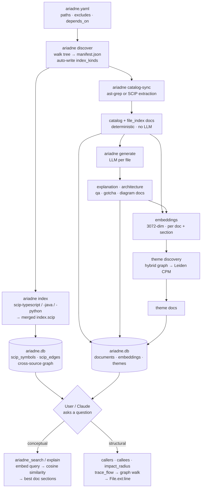

# How Ariadne Works — A Vanilla User Flow

Ariadne turns a codebase into a queryable knowledge base: a single SQLite
file holding structured documentation, semantic embeddings, conceptual
theme clusters, and a cross-language symbol graph. Below is the end-to-end
flow, from configuration to answering a question.

## Flow at a glance

The build steps (discover → index → catalog-sync → generate → themes) all
write into one `ariadne.db`; the query steps read from it. Steps 1–9 below
walk through each stage.

## 1. The user configures sources (`ariadne.yaml`)

You declare what to read and how: each source's `path`, file globs to
`exclude` (e.g. `**/.env`), `exclude_dirs` to prune at walk time,
`exempt_dirs` to opt back in, cross-repo `depends_on` relationships, and
optional `branches`/`ref` scoping. You only author structural facts — the
SCIP-related fields (`index_kinds`, `scip:`) are filled in for you by
discovery.

## 2. The user runs `ariadne discover`

Ariadne walks the tree and classifies every directory by language. It
writes `<source>/.ariadne/manifest.json` (which indexers to run, in which
sub-directories) and, for any SCIP-routable language it finds
(TypeScript/JS incl. `.vue`, Scala, Java/Kotlin), auto-writes
`index_kinds: <lang>: scip` back into `ariadne.yaml`. No manual indexer
config required.

## 3. The user runs `ariadne index` (SCIP languages)

Per the manifest, Ariadne shells out to `scip-typescript` / `scip-java`
/ `scip-python`, merges the per-language outputs into one
`.ariadne/index.scip`, then **persists a cross-source symbol graph into
`ariadne.db`** — `scip_symbols` (every definition: file, line range, kind,
name) and `scip_edges` (caller→callee). This graph is what powers
structural queries (`callers`, `callees`, `impact_radius`, `trace_flow`)
across repositories and languages. (Vue files are handled by extracting
`<script>` blocks into line-aligned companions before indexing, then
translating positions back to the original `.vue` file.)

## 4. The user runs `ariadne catalog-sync` (structural, no LLM)

A deterministic pass extracts every class/function/method via ast-grep
(Python/JS) or the SCIP index (typed languages). It writes two doc kinds:
a **`catalog` element row** per symbol (qualified name, signature,
location) and a **`file_index` row per file** (the assembly anchor listing
its elements). Deterministic UUID5 IDs make this idempotent.

## 5. The user runs `ariadne generate` (LLM docs)

For each file, an LLM produces narrative documentation: **`explanation`**
(how it works), **`architecture`** (design decisions + Mermaid diagrams,
with a Dependents section back-filled from the SCIP graph), **`qa`**
(question/answer pairs), **`gotcha`** (pitfalls), and **`diagram`**.
Generation is concurrent, validated, retried, and idempotent (same input →
same row).

## 6. Embeddings are created for every doc

Each document — and each heading-bounded **section chunk** — gets an
OpenAI `text-embedding-3-large` (3072-dim) vector, stored in the
`embeddings` table joined by `doc_id`. This is what makes search by
*intent* ("rate limiting") rather than keyword possible, and lets a query
return the one relevant paragraph instead of a 10KB doc.

## 7. Themes are discovered via a hybrid graph + Leiden

Ariadne builds a **hybrid graph** over catalog elements: *structural* edges
(imports, doc relationships) plus *semantic* k-NN edges (cosine similarity
over the embeddings). The **Leiden** community-detection algorithm (CPM
quality function) clusters this graph into cohesive groups; each cluster
becomes an LLM-summarized **`theme`** doc. Themes are how Ariadne answers
"what are the major concerns in this codebase?" — and because the graph
spans languages and repos, a theme can cut across all of them.

## 8. Everything lives in one SQLite library

`ariadne.db` combines it all: `documents` (the retrieval unit),
`embeddings`, `themes`/`theme_members`, and the `library_scip` graph
tables. WAL mode lets long generation runs coexist with concurrent reads.

## 9. The user (or Claude) asks a question

- **Conceptual question** (`ariadne_search` / `ariadne_explain`, usually
  via MCP): the query is embedded, compared by cosine similarity against
  the section-level embeddings, and the best-matching doc chunks are
  returned — enriched with cross-references and, when a SCIP graph exists,
  the symbol's dependents. One tool call replaces many file reads.
- **Structural question** (`ariadne callers/callees/impact_radius/
  trace_flow`): served directly from the `library_scip` graph, returning
  real `File.ext:line` locations and following edges across language and
  repository boundaries.

The result: Claude consults Ariadne *first*, getting curated, pre-computed
answers instead of re-deriving them from raw source every time.
