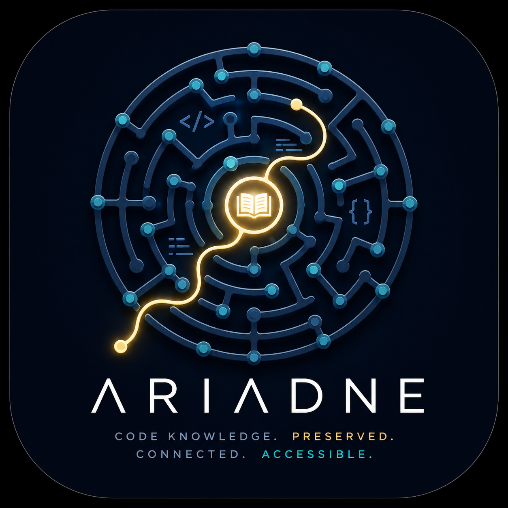
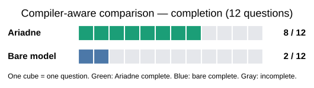

<p align="center">
  
</p>

# Ariadne

A compiler-grounded knowledge base for LLM agents. Ariadne indexes a codebase, generates concise documentation, and serves source-backed results over MCP so an agent can navigate code without rediscovering its structure on every question.

> **License: [Apache 2.0](LICENSE).** Free to use, modify, and redistribute, including commercially.

## Why Ariadne?

Normal code search starts from strings and files. Ariadne also uses [SCIP](docs/scip-cross-source.md): compiler-derived identities, definitions, call sites, ownership, and cross-language relationships. It combines that structure with generated documentation and semantic search, then keeps changed files current rather than rebuilding the whole corpus.

## A reviewed compiler-aware comparison

The public comparison uses twelve difficult, target-pinned questions about Spark 4.0.0 and Delta 4.0.0. Ariadne receives compiler-derived relationships and source evidence; the bare LLM receives ordinary source reads and text search. A completed question must satisfy every required source-backed claim.

<p align="center">
  
</p>

| Reviewed measure | Ariadne | Bare LLM |
| --- | ---: | ---: |
| Completed questions | **8 / 12** | **2 / 12** |
| Symbols | 112 / 121 (93%) | 0 / 121 (0%)¹ |
| Definitions | 109 / 122 (89%) | 74 / 122 (61%) |
| Relation sites | 88 / 97 (91%) | 26 / 97 (27%) |
| Witness fragments | 159 / 187 (85%) | 114 / 187 (61%) |

¹ The bare run did not emit canonical symbol IDs, so its symbol figure is a format-limited lower bound. These results apply to this reviewed panel only.

- [Comparison report](evaluation/chain-benchmark/COMPILER_AWARE_COMPARISON.md)
- [Public panel record](evaluation/chain-benchmark/compiler-aware-comparison-record.json)
- [Offline verifier](evaluation/chain-benchmark/verify_compiler_aware_comparison.py)
- [Minimal target source-root builder](evaluation/chain-benchmark/build_compiler_aware_source_root.py)

## What it provides

- **Compiler-grounded navigation.** Exact symbol lookup, callers/callees, ownership, impact analysis, and cross-source relationships for supported languages.
- **Generated, searchable documentation.** Explanations, architecture notes, Q&A, gotchas, diagrams, and Leiden-discovered themes.
- **MCP access.** A single SQLite-backed library for Claude Code and other MCP-enabled agents, scoped to the codebase and its declared dependencies.
- **Predictable spend.** `dry-run` estimates generation cost before any paid work; git-aware sync refreshes only changed files.
- **Version-pinned spools.** Optional knowledge packs ground questions in a target system's own source, such as a Databricks runtime.

## Quick start

```bash
git clone https://github.com/AvivAvital2/ariadne.git
cd ariadne
uv sync

# Register a source, inspect projected cost, then build the library.
uv run ariadne source add myproject --path /path/to/myproject/src
uv run ariadne dry-run -i --source myproject
uv run ariadne onboard --source myproject
```

Generation needs `OPENAI_API_KEY` for embeddings and either Anthropic or OpenAI for documentation generation. `onboard` previews cost and asks before paid work. For MCP integration with Claude Code:

```bash
cd /path/to/your-project
uv run --directory /path/to/ariadne ariadne init --source myproject
```

## Learn more

- [First-run walkthrough](docs/new-project-onboarding.md)
- [Configuration](docs/configuration.md)
- [CLI command reference](docs/commands.md)
- [MCP tools](docs/mcp-tools.md)
- [SCIP and cross-source indexing](docs/scip-cross-source.md)
- [Architecture](docs/architecture.md)
- [Environment spools](docs/building-a-databricks-spool.md)

## License

[Apache License 2.0](LICENSE)
