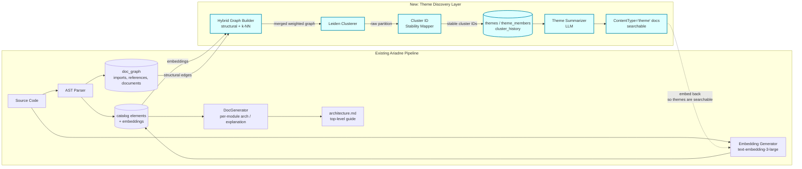
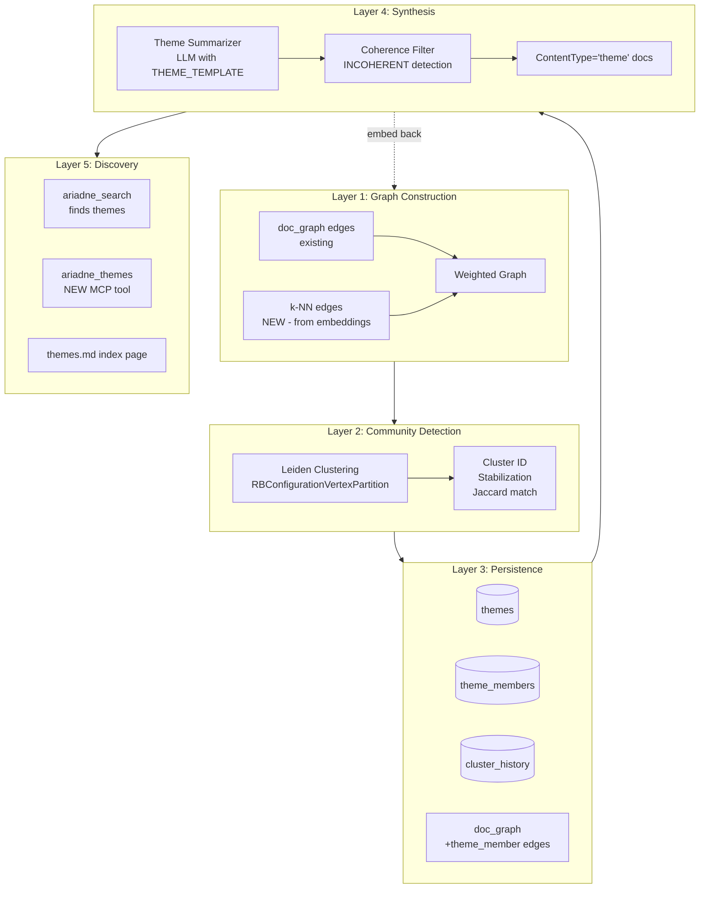
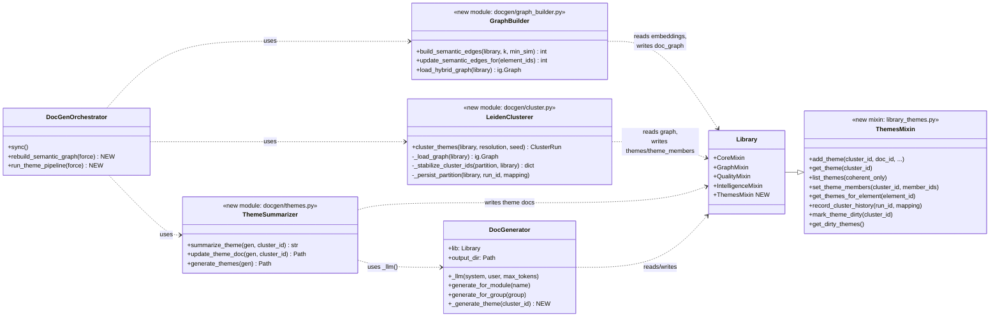
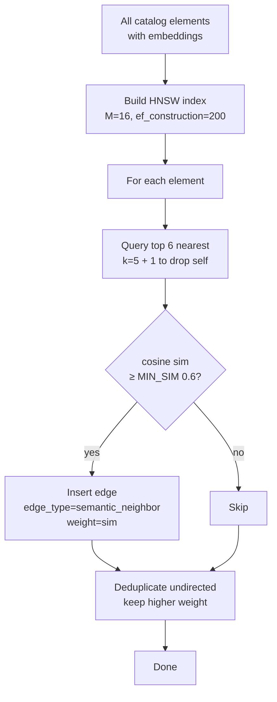
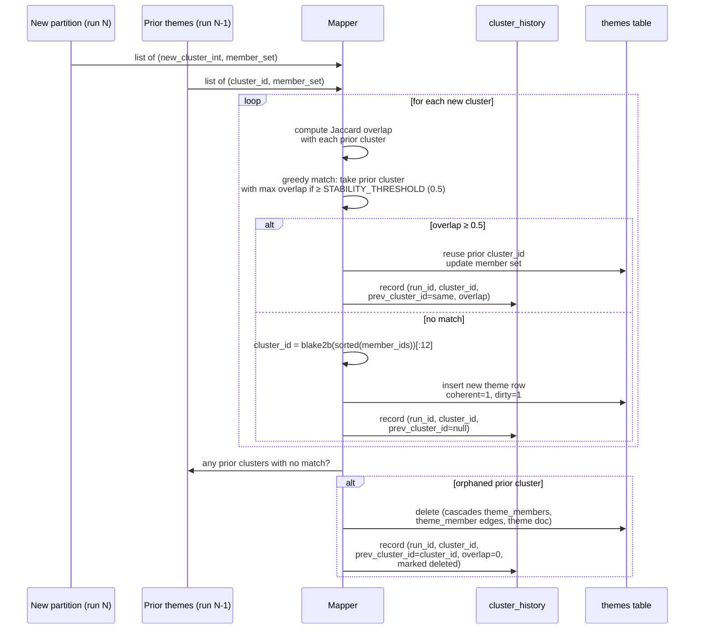
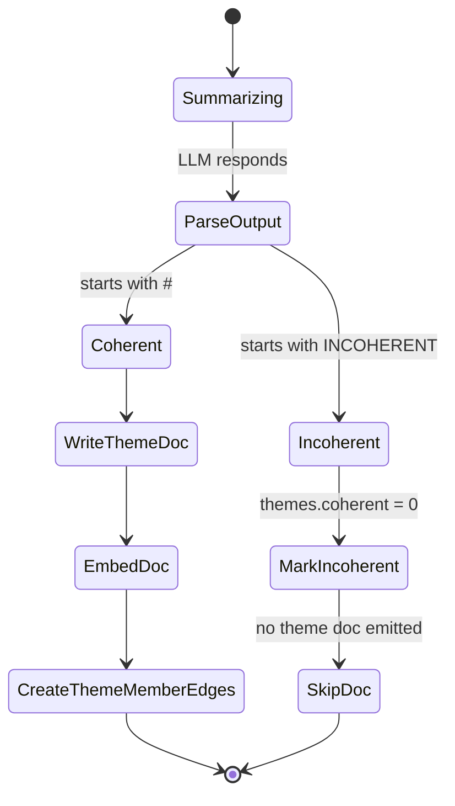
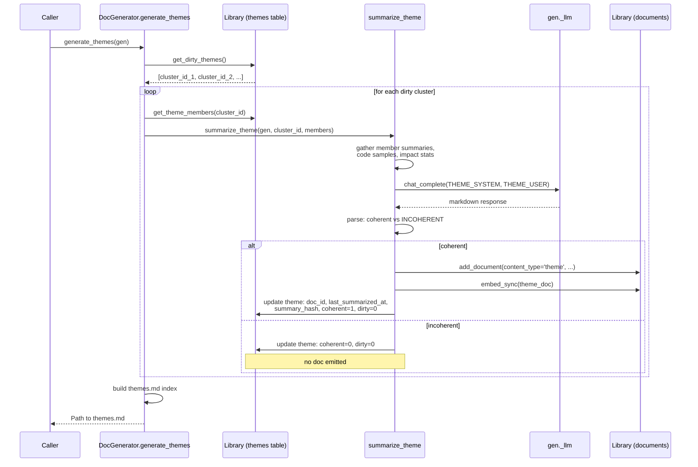
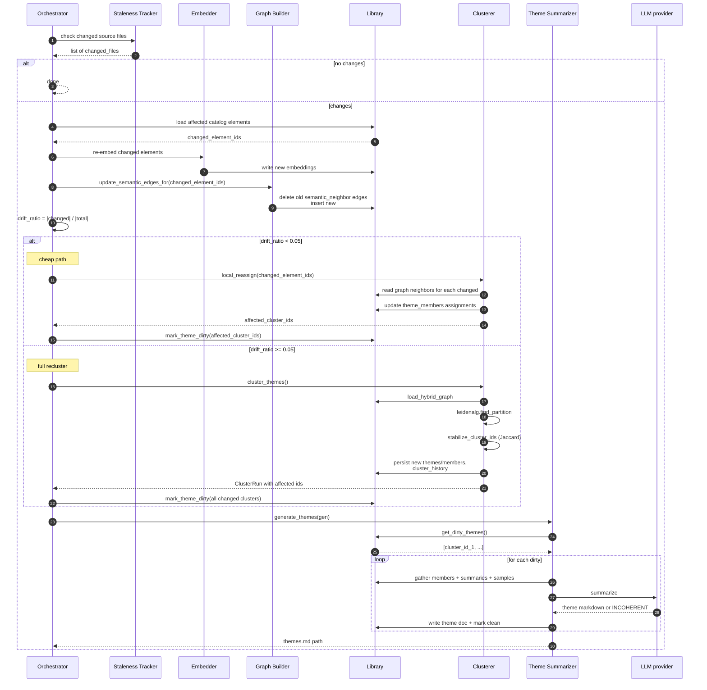

# Cross-Cutting Themes via Leiden Clustering — Implementation Plan

**Status:** locked design, not yet implemented
**Date locked:** 2026-04-27
**Goal:** add automatic discovery of cross-cutting themes (cluster-level theme docs) to Ariadne, closing the gap with GraphRAG's community summaries while keeping update cost dramatically lower.

---

## 1) Goal & Success Criteria

### 1.1 Problem statement

Ariadne's current synthesis hierarchy follows pre-existing module/file boundaries. Documents are produced via:

- `generate_for_module(module_name)` — one architecture/explanation doc per module
- `generate_for_group(group_id)` — one doc per `ModuleGroup`
- `generate_architecture(gen)` — one top-level system guide synthesized from the per-module arch docs, ranked by `impact_radius`

Cross-cutting themes that span modules — e.g., "all retry logic," "all timezone handling," "all error-reporting paths," "all places that touch the LLM provider," "all SQLite migration helpers" — surface only when someone explicitly asks `generate_for_topic("retry")`. They are never **discovered** automatically. This is a real capability gap relative to GraphRAG, whose Leiden-based community detection over an entity graph emits community summaries for whatever clusters the data actually contains, regardless of file structure.

### 1.2 Solution outline

Add a community-detection layer that:

1. **Builds a hybrid graph** over existing catalog elements:
   - Structural edges from the existing `doc_graph` table (free — already populated by AST parser)
   - Sparse semantic k-NN edges derived from existing per-element embeddings (cheap — O(N log N) with ANN index, no LLM calls)
2. **Runs Leiden clustering** on the merged weighted graph. Communities emerge regardless of module boundaries.
3. **Emits one LLM-generated `theme` doc** per coherent community via the existing `_llm()` infrastructure and a new `THEME_TEMPLATE` prompt.
4. **Maintains everything incrementally** with cost proportional to actual change: SHA-gated re-embedding, log-time k-NN updates, local cluster reassignment for small drift, periodic full re-cluster when drift accumulates.

The critical architectural choice: we **skip GraphRAG's expensive step entirely** — per-chunk LLM entity extraction. Ariadne already has what that step produces, via two cheaper sources:

- AST parsing → reference and import edges
- Embedding generation → semantic proximity

This is the reason this approach is roughly two-to-three orders of magnitude cheaper than a literal GraphRAG port for the same outcome.

### 1.3 Success criteria

| Metric | Target |
|---|---|
| New `ContentType = 'theme'` exists; theme docs surface via `ariadne_search` | yes |
| Initial build on Ariadne's own codebase (~5–20k catalog elements) | < 10 min wall, < $30 LLM spend |
| Per-sync incremental cost when changing 1 element | ≤ 1 LLM call (theme re-summary), ≤ 5 if neighbors shift cluster |
| Cluster ID stability across syncs with no graph change | 100% (deterministic w/ seed) |
| Cluster ID stability across syncs with minor change (<5% nodes touched) | ≥ 95% via Jaccard mapping |
| Existing Ariadne functionality (search, list, generate_*) | unchanged |
| Theme title quality on representative codebase | ≥ 80% specific (not "Helpers"/"Utilities") |

### 1.4 Non-goals

- Replacing existing module-bounded arch docs. Themes are **additive**.
- Real-time clustering. Re-cluster runs on sync, not on every query.
- GraphRAG-style per-chunk entity extraction. Explicitly avoided.
- Multi-repo cross-source themes (deferred — see §11).
- Hierarchical themes-of-themes (deferred — see §11).

---

## 2) Architecture Overview

### 2.1 System context (where this fits in Ariadne)



**Reuses, no changes:** `embedding.py`, `library_core.get_embeddings_for_ids`, `doc_graph` table, `docgen/staleness.py` SHA gating, `_llm()` infrastructure, existing search.

**Adds:** new tables (`themes`, `theme_members`, `cluster_history`); new modules (`docgen/graph_builder.py`, `docgen/cluster.py`, `docgen/themes.py`); new `library_themes.py` mixin; new generator handler `generate_themes`; small ANN-index k-NN job using `hnswlib`.

### 2.2 Layered view



### 2.3 Class / module diagram



---

## 3) Data Model Changes

### 3.1 Entity-relationship diagram (new tables in context)

```mermaid
erDiagram
    documents ||--o{ doc_graph : "appears as source/target"
    documents ||--o| themes : "doc_id (theme content)"
    documents ||--o{ theme_members : "element_id"
    themes ||--o{ theme_members : "cluster_id"
    themes ||--o{ cluster_history : "cluster_id"

    documents {
        TEXT id PK
        TEXT content_type "explanation|architecture|...|theme NEW"
        TEXT title
        TEXT content
        BLOB embedding
        TEXT source_name
        TEXT source_files
        TEXT metadata_json
    }

    doc_graph {
        TEXT source_id FK
        TEXT target_id FK
        TEXT edge_type "imports|documents|topic_member|semantic_neighbor NEW|theme_member NEW"
        REAL weight
    }

    themes {
        TEXT cluster_id PK "stable across runs via Jaccard mapping"
        TEXT doc_id FK "to ContentType=theme document"
        INTEGER member_count
        REAL resolution "Leiden gamma at last build"
        TEXT last_built_at
        TEXT last_summarized_at
        TEXT summary_hash "blake2b of summarization inputs"
        BOOLEAN coherent "false if LLM returned INCOHERENT"
        BOOLEAN dirty "needs re-summary"
    }

    theme_members {
        TEXT cluster_id PK_FK
        TEXT element_id PK_FK
        REAL weight "distance to centroid / cluster cohesion"
        TEXT joined_at
    }

    cluster_history {
        INTEGER run_id PK
        TEXT cluster_id PK_FK
        TEXT prev_cluster_id "best-overlap predecessor"
        REAL overlap_ratio "Jaccard"
    }
```

### 3.2 Schema additions

In `schema.py:22`:

```python
# extend existing literal
ContentType = Literal[
    'explanation', 'architecture', 'qa', 'diagram',
    'catalog', 'finding', 'gotcha',
    'theme',  # NEW
]
```

In `library.py` alongside `_DOC_GRAPH_SCHEMA` at lines ~156–164, add:

```python
_THEMES_SCHEMA = '''
CREATE TABLE IF NOT EXISTS themes (
    cluster_id TEXT PRIMARY KEY,
    doc_id TEXT NOT NULL UNIQUE,
    member_count INTEGER NOT NULL,
    resolution REAL NOT NULL,
    last_built_at TEXT NOT NULL,
    last_summarized_at TEXT NOT NULL,
    summary_hash TEXT NOT NULL,
    coherent INTEGER NOT NULL DEFAULT 1,
    dirty INTEGER NOT NULL DEFAULT 0,
    FOREIGN KEY (doc_id) REFERENCES documents(id) ON DELETE CASCADE
);
'''

_THEME_MEMBERS_SCHEMA = '''
CREATE TABLE IF NOT EXISTS theme_members (
    cluster_id TEXT NOT NULL,
    element_id TEXT NOT NULL,
    weight REAL NOT NULL DEFAULT 1.0,
    joined_at TEXT NOT NULL,
    PRIMARY KEY (cluster_id, element_id),
    FOREIGN KEY (cluster_id) REFERENCES themes(cluster_id) ON DELETE CASCADE,
    FOREIGN KEY (element_id) REFERENCES documents(id) ON DELETE CASCADE
);
CREATE INDEX IF NOT EXISTS idx_theme_members_element ON theme_members(element_id);
CREATE INDEX IF NOT EXISTS idx_theme_members_cluster ON theme_members(cluster_id);
'''

_CLUSTER_HISTORY_SCHEMA = '''
CREATE TABLE IF NOT EXISTS cluster_history (
    run_id INTEGER NOT NULL,
    cluster_id TEXT NOT NULL,
    prev_cluster_id TEXT,
    overlap_ratio REAL,
    created_at TEXT NOT NULL,
    PRIMARY KEY (run_id, cluster_id)
);
CREATE INDEX IF NOT EXISTS idx_cluster_history_prev ON cluster_history(prev_cluster_id);
'''
```

Wire all three into `_init_db` so they execute on connection bootstrap.

### 3.3 New edge types in `doc_graph`

The existing `doc_graph` table already supports an `edge_type` column (per `library_graph.GraphMixin.edge_type` which uses `'topic_member'` and `'documents'`). Add two new types — **no schema change needed**:

| edge_type | Direction | Weight semantics | Lifecycle |
|---|---|---|---|
| `semantic_neighbor` | undirected (stored as both A→B, B→A or canonicalized A<B) | cosine similarity in (min_sim, 1] | created/refreshed by graph builder; deleted on element re-embed |
| `theme_member` | element → theme doc | constant 1.0 | created when cluster_id assignment is finalized; deleted when element leaves cluster |

The `theme_member` edges are **redundant** with the `theme_members` table by design — they exist so graph traversal queries (`gen.lib.explain`, `impact_radius`) naturally see themes as nodes connected to their members.

---

## 4) Algorithm Specifications

### 4.1 Hybrid graph construction

**Inputs:** all catalog elements with non-null embeddings + all existing `doc_graph` edges.

**Semantic edge generation (per element):**



**Edge weight composition for clustering:**

| Source | Raw weight | Final weight |
|---|---|---|
| `imports` (structural) | 1.0 | 1.0 |
| `documents` (catalog→doc) | 1.0 | 1.0 |
| `topic_member` (existing topic linkage) | 1.0 | 1.0 |
| `semantic_neighbor` (k-NN) | cosine sim ∈ (0.6, 1.0] | sim × `SEM_EDGE_SCALE` (default 0.5) |

**Why these defaults:**
- `k=5` keeps graph sparse (~10·N total edges → linear scaling, see §4.7)
- `min_sim=0.6` drops noise edges (random pairs of docs cluster around 0.3–0.5)
- `SEM_EDGE_SCALE=0.5` prevents semantic edges from dominating real code structure; if you used 1.0, two unrelated functions with similar docstrings could overpower a real import edge

### 4.2 Leiden clustering

```python
import igraph as ig
import leidenalg as la

g = ig.Graph(n=len(node_ids), edges=edge_list, directed=False)
g.vs['name'] = node_ids
g.es['weight'] = edge_weights

partition = la.find_partition(
    g,
    la.RBConfigurationVertexPartition,
    weights='weight',
    resolution_parameter=LEIDEN_RESOLUTION,  # default 1.0
    seed=LEIDEN_SEED,                         # default 42
    n_iterations=-1,                          # iterate until convergence
)
```

**Why `RBConfigurationVertexPartition`:** modularity-style objective with a tunable resolution parameter. Most flexible variant of Leiden's quality functions; lets us tune cluster size without changing algorithms. Other options (`ModularityVertexPartition`, `CPMVertexPartition`) are less tunable or require different parameters.

**Defaults to expose as config:**

| Parameter | Default | Range | Effect |
|---|---|---|---|
| `LEIDEN_RESOLUTION` | 1.0 | 0.5–2.0 | Higher → more, smaller clusters |
| `LEIDEN_SEED` | 42 | any int | Reproducibility |
| `MIN_CLUSTER_SIZE` | 3 | 1–10 | Drop tiny clusters; members reassigned to next-best |
| `MAX_CLUSTER_SIZE` | 200 | 50–500 | Above this, cluster gets split (deferred to Phase 8 — §11) |

### 4.3 Cluster ID stability across runs

Run N produces fresh integer cluster numbers from `leidenalg`. Map them to stable string IDs as follows:



**Jaccard overlap formula:**

```
overlap(C_new, C_prior) = |C_new ∩ C_prior| / |C_new ∪ C_prior|
```

**Greedy matching pseudocode:**

```python
def stabilize(new_clusters: dict[int, set[str]],
              prior_clusters: dict[str, set[str]],
              threshold: float = 0.5) -> dict[int, str]:
    mapping = {}
    used_prior = set()
    # sort by size desc so big clusters get priority on overlap matches
    for new_id, new_members in sorted(new_clusters.items(),
                                       key=lambda kv: -len(kv[1])):
        best_prior, best_score = None, 0.0
        for prior_id, prior_members in prior_clusters.items():
            if prior_id in used_prior:
                continue
            score = jaccard(new_members, prior_members)
            if score > best_score:
                best_prior, best_score = prior_id, score
        if best_score >= threshold:
            mapping[new_id] = best_prior
            used_prior.add(best_prior)
        else:
            mapping[new_id] = stable_hash(new_members)
    return mapping
```

### 4.4 Theme summarization (LLM step)

For each cluster (initial build) or each cluster with `dirty=1` and `coherent=1`:

**Inputs gathered (in order of cost):**

1. Cluster member list (qualified names + file paths) — free, from `theme_members`
2. For each member: existing summary truncated to ~300 chars — free, from member's existing doc
3. Up to 3 sample code snippets (~50 lines each) from highest-degree members — free, file read
4. Existing dependency stats from `gen.lib.impact_radius` for top members — already computed

**Prompt** (new constant in `docgen/prompts.py`, alongside `ARCHITECTURE_TEMPLATE`):

```python
THEME_SYSTEM_PROMPT = """\
You are a senior engineer analyzing a code cluster discovered via graph clustering.
Your job: determine WHAT THIS CLUSTER IS ABOUT (the cross-cutting theme), and produce
a clear theme document.

The cluster was found ALGORITHMICALLY by combining import structure with embedding
similarity. It is NOT necessarily a coherent theme — sometimes the algorithm groups
things that share surface features but no real concern. If that is the case, say so.

Anti-patterns to avoid in your output:
- Generic titles ("Helpers", "Utilities", "Common Code", "Misc") — these mean you
  failed to find the actual theme
- Restating member names — readers can see the list themselves
- Padding with boilerplate sections when there is nothing interesting to say
"""

THEME_USER_TEMPLATE = """\
Analyze this cluster of {n_members} code elements. Top {k_shown} members shown by
graph centrality (in-degree). Code samples included for the top 3.

Members:
{member_list_with_summaries}

Sample code from anchor members:
{code_snippets}

Cross-references (impact_radius):
{impact_summaries}

Produce a markdown document with:

# <Title>
A short, specific noun phrase. Examples: "Retry Logic with Exponential Backoff",
"DB Connection Lifecycle", "LLM Prompt Construction". Forbidden: anything generic.

## What this is
2-3 sentences describing the theme.

## Why this is a coherent theme
One paragraph: what is the unifying concern? What problem do these members
collectively solve? What invariant or pattern do they share?

## Key participants
Bulleted list of the most important members with their role in the theme.
Each bullet: `- **<member>** — <role in this theme>`. List 5–15 max.

## Cross-cutting concerns
Which other parts of the codebase does this theme touch? Reference modules
or other themes if obvious. Be specific.

## Caveats
Any noise in the cluster — members that don't quite fit, ambiguity in the
theme, anything a reader should know to interpret this correctly.
Be honest. If there's no caveat, write "None apparent."

---

If the members do NOT form a coherent theme — if the cluster looks like
algorithmic noise rather than a real concept — output exactly the literal
string:

INCOHERENT

Followed by a one-paragraph explanation of why. The cluster will be skipped.
"""
```

**Coherence handling:**



If the LLM returns `INCOHERENT`, set `themes.coherent=0` and skip the doc emit. The cluster row remains for graph queries but is filtered out of `ariadne_search`. On the next run, if Jaccard mapping reassigns the cluster_id to a more coherent grouping, `coherent` flips back via re-summarization.

### 4.5 Summary cache key

```python
def compute_summary_hash(members: list[str],
                         summaries: list[str],
                         resolution: float) -> str:
    h = hashlib.blake2b(digest_size=16)
    for mid in sorted(members):
        h.update(mid.encode())
        h.update(b'\x00')
    for s in summaries:  # in same order as sorted members
        h.update(s.encode())
        h.update(b'\x00')
    h.update(f'{resolution:.4f}'.encode())
    return h.hexdigest()
```

Re-summarize only when `summary_hash` differs from stored value. This means trivial member shuffling without content change → no LLM call.

### 4.6 Local cluster reassignment (cheap incremental path)

When `|dirty_elements| / |total_elements| < RECLUSTER_THRESHOLD` (default 0.05), skip full Leiden and reassign only changed elements:

```python
def local_reassign(library, changed_element_ids: set[str]) -> set[str]:
    """
    Returns the set of cluster_ids whose membership changed (need re-summarize).
    """
    affected_clusters = set()
    for eid in changed_element_ids:
        # find element's neighbors in updated graph
        neighbors = library.get_graph_neighbors(eid, edge_types=['imports', 'documents', 'semantic_neighbor'])
        # for each neighboring cluster, sum incoming edge weight from this element
        cluster_scores = defaultdict(float)
        for nid, weight in neighbors:
            n_cluster = library.get_themes_for_element(nid)  # may be None
            if n_cluster is not None:
                cluster_scores[n_cluster] += weight
        if not cluster_scores:
            continue
        best_cluster = max(cluster_scores, key=cluster_scores.get)
        old_cluster = library.get_themes_for_element(eid)
        if best_cluster != old_cluster:
            library.set_theme_member(eid, best_cluster)
            affected_clusters.add(best_cluster)
            if old_cluster is not None:
                affected_clusters.add(old_cluster)
    return affected_clusters
```

**When this is good:** small content edits that don't change a function's role.
**When this is wrong:** when many elements shift and the cluster boundaries themselves should move. The `RECLUSTER_THRESHOLD` gate handles this — once enough drift accumulates, full Leiden re-runs.

### 4.7 Cost analysis (formal)

| Operation | Asymptotic cost | Concrete (10k elements) |
|---|---|---|
| HNSW index build | O(N log N) | ~10–30 sec |
| k-NN query (per element) | O(log N) | ~0.1 ms |
| Total k-NN over all elements | O(N log N) | ~1–5 sec |
| Loading hybrid graph | O(E) where E ≈ 10·N | < 1 sec |
| Leiden clustering | O(E log V) | 2–10 sec for ~100k edges |
| Cluster stabilization (Jaccard) | O(C_new · C_prior) | < 1 sec for ~200 clusters |
| Theme summarization (LLM) | 1 call per touched cluster | $0.05–$0.30 per cluster |
| Embedding theme doc | 1 call per touched cluster | ~$0.0001 per |

**Per-sync incremental cost** (1 element changed):
- Re-embed: 1 OpenAI call (~$0.0001)
- HNSW update: O(log N), ~0.1 ms
- Local reassign check: O(degree_of_element) = O(1) effectively
- Most likely 0 LLM calls; occasionally 1 if cluster membership crosses threshold

**Initial build cost** (10k elements, ~150 clusters):
- Embeddings: already paid by Ariadne baseline
- Graph + cluster: ~30 sec total
- Theme summaries: ~150 LLM calls × $0.10 avg = ~$15
- Wall time: ~5 min if LLM calls run with concurrency=10

This matches the success criteria targets in §1.3.

---

## 5) Implementation Phases

Each phase is independently mergeable, has explicit acceptance tests, and leaves the system in a working state. Commit after each.

### Phase progression diagram

```mermaid
gantt
    title Theme Discovery Implementation Phases
    dateFormat X
    axisFormat %s

    section Foundation
    Phase 1 - Schema + library extension       :p1, 0, 2
    section Graph
    Phase 2 - Hybrid graph builder              :p2, after p1, 3
    Phase 3 - Leiden clusterer                  :p3, after p2, 2
    section Synthesis
    Phase 4 - Theme summarizer                  :p4, after p3, 3
    section Maintenance
    Phase 5 - Incremental update wiring         :p5, after p4, 2
    section Discovery
    Phase 6 - Search/MCP integration            :p6, after p5, 2
    Phase 7 - CLI + dashboard surface (optional):p7, after p6, 2
```



### 5.1 Phase 1 — Schema + library extension

**Goal:** persistence layer ready; no behavior change yet.

**Files touched:**

| File | Change |
|---|---|
| `schema.py:22` | Add `'theme'` to `ContentType` |
| `library.py:156` | Add `_THEMES_SCHEMA`, `_THEME_MEMBERS_SCHEMA`, `_CLUSTER_HISTORY_SCHEMA`; wire into `_init_db` |
| `library_themes.py` (new) | `ThemesMixin` with all CRUD methods |
| `library.py` class composition | Add `ThemesMixin` to `Library` MRO |

**`ThemesMixin` API:**

```python
class ThemesMixin:
    def add_theme(self, *, cluster_id: str, doc_id: str, member_count: int,
                  resolution: float, summary_hash: str, coherent: bool = True) -> None: ...
    def get_theme(self, cluster_id: str) -> Theme | None: ...
    def list_themes(self, *, coherent_only: bool = True,
                    source: str | None = None) -> list[Theme]: ...
    def delete_theme(self, cluster_id: str) -> None: ...
    def set_theme_members(self, cluster_id: str,
                          members: list[tuple[str, float]]) -> None: ...
    def get_theme_members(self, cluster_id: str) -> list[tuple[str, float]]: ...
    def get_themes_for_element(self, element_id: str) -> list[str]: ...
    def mark_theme_dirty(self, cluster_id: str) -> None: ...
    def mark_themes_clean(self, cluster_ids: list[str]) -> None: ...
    def get_dirty_themes(self) -> list[str]: ...
    def update_summary_hash(self, cluster_id: str, summary_hash: str) -> None: ...
    def record_cluster_history(self, run_id: int,
                               mappings: list[ClusterMapping]) -> None: ...
    def latest_cluster_run(self) -> int | None: ...
```

**Acceptance:**
- `pytest tests/test_library_themes.py` passes — covers: insert theme, list, FK cascade on delete, membership queries, dirty/clean transitions, history recording.
- `uvx ty check` clean.
- Existing test suite unchanged (no regressions).

**Estimated effort:** 0.5 day.

### 5.2 Phase 2 — Hybrid graph builder

**Goal:** semantic edges populated; can rebuild whole graph or update for changed elements.

**Files touched:**

| File | Change |
|---|---|
| `pyproject.toml` | Add `hnswlib`, `igraph`, `leidenalg` |
| `docgen/graph_builder.py` (new) | `build_semantic_edges`, `update_semantic_edges_for`, `load_hybrid_graph` |
| `docgen/orchestrator.py` | New method `rebuild_semantic_graph(force: bool = False)` |

**Module signatures:**

```python
def build_semantic_edges(
    library: Library,
    *,
    k: int = 5,
    min_sim: float = 0.6,
    source: str | None = None,
) -> int:
    """
    Build/refresh all semantic_neighbor edges in doc_graph.
    Returns number of edges written.
    Idempotent: clears prior semantic_neighbor edges first.
    """

def update_semantic_edges_for(
    library: Library,
    element_ids: list[str],
    *,
    k: int = 5,
    min_sim: float = 0.6,
) -> int:
    """
    Refresh only the outgoing semantic_neighbor edges for given elements.
    Used incrementally when elements re-embed.
    """

def load_hybrid_graph(
    library: Library,
    *,
    semantic_edge_scale: float = 0.5,
    source: str | None = None,
) -> tuple[ig.Graph, list[str]]:
    """
    Returns (graph, node_ids) where graph.vs['name'] = node_ids.
    Combines all edge_types per §4.1 weight composition.
    """
```

**Algorithm details:**
1. `embeddings_map = library.get_embeddings_for_ids(all_catalog_doc_ids)`
2. Build HNSW index: `M=16`, `ef_construction=200`, `ef_search=64`. Use `'cosine'` space.
3. For each element, query top-6 (k+1 to drop self).
4. Filter by `min_sim`; insert edges into `doc_graph` with `edge_type='semantic_neighbor'`.
5. **Idempotency:** before write, `DELETE FROM doc_graph WHERE edge_type = 'semantic_neighbor' AND source_id IN (?)`.

**Acceptance:**
- `pytest tests/test_graph_builder.py` — synthetic 10-element fixture with 4 obvious clusters, verify cluster-internal edges all present, cross-cluster edges only at high-similarity boundaries.
- Idempotency test: run twice, assert identical edge set.
- Performance: 10k elements builds in < 60s on a typical dev machine.
- `load_hybrid_graph` test: confirm weights match §4.1 specification.

**Estimated effort:** 1 day.

### 5.3 Phase 3 — Leiden clusterer

**Goal:** produce stable cluster IDs from hybrid graph; persist to themes/theme_members/cluster_history.

**Files touched:**

| File | Change |
|---|---|
| `docgen/cluster.py` (new) | Main entry + helpers |

**Module signatures:**

```python
@frozen
class ClusterRun:
    run_id: int
    clusters: dict[str, set[str]]  # cluster_id -> member_ids
    new_cluster_ids: set[str]
    deleted_cluster_ids: set[str]
    membership_changes: dict[str, tuple[str | None, str | None]]  # element_id -> (old, new)

def cluster_themes(
    library: Library,
    *,
    resolution: float = 1.0,
    seed: int = 42,
    min_cluster_size: int = 3,
    stability_threshold: float = 0.5,
    source: str | None = None,
) -> ClusterRun: ...

def _load_graph(library, source) -> tuple[ig.Graph, list[str]]: ...
def _run_leiden(g, resolution, seed) -> dict[int, set[str]]: ...
def _stabilize_cluster_ids(new_clusters, prior_clusters, threshold) -> dict[int, str]: ...
def _persist_partition(library, run_id, clusters, mapping_metadata) -> None: ...
```

**Persistence behavior:**
- Compute next `run_id` (max existing + 1)
- For each new cluster: insert/update `themes` row, mark `dirty=1`
- Replace all rows in `theme_members` for affected cluster_ids
- Insert mapping records into `cluster_history`
- Delete orphaned themes (cascades members and theme_member edges)
- Refresh `theme_member` edges in `doc_graph`

**Acceptance:**
- `pytest tests/test_cluster.py`:
  - **Recovery test:** synthetic graph with 3 known communities, verify Leiden recovers them (modulo ID renaming).
  - **Stability test:** identical input → identical cluster_ids on re-run.
  - **Drift test:** modify ~10% of memberships, assert majority of cluster_ids preserved via Jaccard.
  - **Merge test:** force two clusters to merge, assert correct prev_cluster_id history records.
  - **Tiny-cluster filtering:** clusters < min_cluster_size dropped, members reassigned.
- Performance: 100k edges clusters in < 10s.

**Estimated effort:** 1 day.

### 5.4 Phase 4 — Theme summarizer

**Goal:** generate theme docs for clusters; respect coherence filter; expose via DocGenerator.

**Files touched:**

| File | Change |
|---|---|
| `docgen/prompts.py` | Add `THEME_SYSTEM_PROMPT`, `THEME_USER_TEMPLATE` |
| `docgen/themes.py` (new) | `summarize_theme`, `update_theme_doc`, `generate_themes` |
| `docgen/generator.py:129` | New method `_generate_theme(self, cluster_id) -> GeneratedDoc \| None` |
| `docgen/generator.py` (handler reg.) | Add `generate_themes` to `_HANDLERS` and `DOC_TYPES` |

**Behavior:**



**`generate_themes` signature:**

```python
async def generate_themes(gen: DocGenerator) -> Path:
    """
    Re-summarizes all dirty themes. Writes themes.md index page listing
    coherent themes with links. Returns path to themes.md.
    Idempotent: safe to call repeatedly; no-op if no dirty themes.
    """
```

**Acceptance:**
- `pytest tests/test_themes_e2e.py` — full pipeline on 100-element fixture: build graph → cluster → summarize → assert N themes created, all searchable via `library.search`.
- `pytest tests/test_themes_prompt.py` — fake LLM returning "INCOHERENT" → asserts no doc emitted, theme marked incoherent.
- **Quality manual check:** generate themes on Ariadne's own codebase. Read 5 generated theme titles + first paragraphs. ≥80% should be specific (not "Helpers"/"Utilities"). If not, iterate `THEME_SYSTEM_PROMPT`.

**Estimated effort:** 1.5 days (most of which is prompt iteration).

### 5.5 Phase 5 — Incremental update wiring

**Goal:** sync flow knows about themes; cheap when little changes, falls back to full recluster on drift.

**Files touched:**

| File | Change |
|---|---|
| `docgen/staleness.py` | No change needed — themes use their own `dirty` column |
| `docgen/orchestrator.py` | Extend sync flow per protocol below |

**Sync protocol:**

```mermaid
flowchart TB
    START[Sync triggered] --> SHA[SHA-gate which catalog<br/>elements changed]
    SHA --> Q{Any changed?}
    Q -->|no| END[Done - no theme work]
    Q -->|yes| REEMBED[Re-embed changed elements<br/>existing infra]
    REEMBED --> KNN[Update semantic edges<br/>for changed elements only]
    KNN --> RATIO{|changed| /<br/>|total| >= 0.05?}
    RATIO -->|yes - drift| FULL[cluster_themes - full Leiden]
    RATIO -->|no - small| LOCAL[local_reassign for<br/>changed elements]
    FULL --> STABLE[stabilize cluster IDs]
    LOCAL --> AFFECTED[mark affected clusters dirty]
    STABLE --> AFFECTED
    AFFECTED --> SUMMARIZE[generate_themes - re-summarize<br/>only dirty clusters]
    SUMMARIZE --> END
```

**Acceptance:**
- `pytest tests/test_themes_incremental.py` — 100-element fixture, modify 1 element, run sync. Assert: ≤1 cluster re-summarized; all others' `last_summarized_at` unchanged.
- `pytest tests/test_themes_full_recluster.py` — modify 30% of elements, assert recluster triggers; ID stability mapping preserves majority.
- `pytest tests/test_themes_no_change.py` — sync with 0 changes triggers 0 LLM calls.

**Estimated effort:** 1 day.

### 5.6 Phase 6 — Search / MCP integration

**Goal:** themes are first-class in retrieval surface.

**Files touched:**

| File | Change |
|---|---|
| `mcp_server.py` | Verify `ariadne_search` filters by `content_type='theme'`; add `ariadne_themes` tool |
| `library_intelligence.py` | Add optional `boost_themes` param to semantic search |
| `config.py` / `ariadne.yaml` | Expose `BOOST_THEMES` (default 1.2) |

**New MCP tool:**

```python
@mcp.tool()
async def ariadne_themes(
    action: Literal['list', 'get', 'members'] = 'list',
    cluster_id: str | None = None,
    coherent_only: bool = True,
    source: str | None = None,
    limit: int = 50,
) -> dict:
    """
    Manage and inspect cross-cutting themes.

    action='list': returns [{cluster_id, title, member_count, ...}, ...]
    action='get': returns full theme doc for cluster_id
    action='members': returns [{element_id, title, weight}, ...] for cluster_id
    """
```

**Acceptance:**
- E2E test: `ariadne_search("retry")` on a fixture with retry-themed cluster surfaces the theme doc among top results.
- `ariadne_themes(action='list')` returns all coherent themes.
- `ariadne_themes(action='get', cluster_id=...)` returns the theme doc.
- `ariadne_themes(action='members', cluster_id=...)` returns members ordered by weight.

**Estimated effort:** 0.5 day.

### 5.7 Phase 7 — CLI + dashboard surface (optional, defer if time-constrained)

**Files touched:**

| File | Change |
|---|---|
| `cli.py` | `ariadne themes build`, `ariadne themes list`, `ariadne themes show <id>` |
| Dashboard (if exists) | Theme browser page |

**Estimated effort:** 0.5–1 day.

---

## 6) Incremental Update Protocol (per-sync flow, detailed)



### 6.1 Cost properties (with concrete numbers)

| Scenario | Re-embeds | k-NN updates | Cluster changes | Re-summaries | LLM calls | Wall time |
|---|---|---|---|---|---|---|
| No source changes | 0 | 0 | 0 | 0 | 0 | <1s |
| 1 element edited | 1 | 1 (log N) | 0–1 cluster | 0–1 | 0–1 | <5s |
| 10 elements edited | 10 | 10 | 1–3 clusters | 1–3 | 1–3 | <30s |
| 5% nodes drifted (full recluster trigger) | ~500 | ~500 | recluster | ~5–20 affected | 5–20 | 1–3 min |
| 30% nodes drifted | ~3k | ~3k | recluster | ~30–50 affected | 30–50 | 5–15 min |
| Initial build (10k cold) | 0 (already done) | full | full Leiden | all ~150 | ~150 | 5–10 min |

This is structurally the same shape as Ariadne's existing SHA-gated sync — a small constant times "things that actually changed."

---

## 7) Configuration

Add to `config.py` and `ariadne.yaml`:

| Key | Env var | Default | Description |
|---|---|---|---|
| `themes_enabled` | `ARIADNE_THEMES_ENABLED` | `true` | Master switch |
| `themes_k_neighbors` | `ARIADNE_THEMES_K` | `5` | k for k-NN graph |
| `themes_min_similarity` | `ARIADNE_THEMES_MIN_SIM` | `0.6` | Cosine sim threshold for semantic edges |
| `themes_semantic_edge_scale` | `ARIADNE_THEMES_SEM_SCALE` | `0.5` | Weight multiplier for semantic vs structural |
| `themes_leiden_resolution` | `ARIADNE_LEIDEN_RES` | `1.0` | Leiden gamma |
| `themes_leiden_seed` | `ARIADNE_LEIDEN_SEED` | `42` | RNG seed |
| `themes_min_cluster_size` | `ARIADNE_THEMES_MIN_SIZE` | `3` | Drop clusters below this |
| `themes_max_cluster_size` | `ARIADNE_THEMES_MAX_SIZE` | `200` | Split above this (Phase 8 — defer) |
| `themes_recluster_threshold` | `ARIADNE_THEMES_RECLUSTER` | `0.05` | Drift fraction triggering full recluster |
| `themes_stability_jaccard` | `ARIADNE_THEMES_STABILITY` | `0.5` | Min overlap to inherit prior cluster_id |
| `themes_summary_model` | `ARIADNE_THEMES_MODEL` | `claude-sonnet-4-6` | Model for theme docs |
| `themes_boost_in_search` | `ARIADNE_THEMES_BOOST` | `1.2` | Search rank multiplier for themes |

---

## 8) Testing Strategy

### 8.1 Unit tests

| File | Coverage |
|---|---|
| `tests/test_library_themes.py` | Schema, CRUD, FK cascades, dirty/clean, history recording |
| `tests/test_graph_builder.py` | k-NN edges on synthetic embeddings, idempotency, weight composition |
| `tests/test_cluster.py` | Leiden recovery, stability mapping (Jaccard), tiny-cluster filtering |
| `tests/test_themes_prompt.py` | Prompt construction, INCOHERENT handling, summary_hash correctness |
| `tests/test_local_reassign.py` | Single-element reassignment moves to highest-weight neighbor cluster |

### 8.2 Integration tests

| File | Coverage |
|---|---|
| `tests/test_themes_e2e.py` | Full pipeline on 100-element fixture |
| `tests/test_themes_incremental.py` | Single-element change → minimal re-summary |
| `tests/test_themes_full_recluster.py` | Drift threshold triggers full Leiden |
| `tests/test_themes_search.py` | Themes appear in `ariadne_search` results |
| `tests/test_themes_mcp.py` | `ariadne_themes` MCP tool actions |
| `tests/test_themes_no_change.py` | Idle sync produces 0 LLM calls |

### 8.3 Performance regression

`tests/test_themes_perf.py`:
- Synthetic 10k-element corpus (deterministic).
- Track wall time and LLM call count for: cold build, idle sync, 1-element-change sync, 5%-drift sync.
- Fail if wall regresses > 20% from baseline; fail if LLM calls exceed expected counts (§6.1).

### 8.4 Quality (manual, executed once at Phase 4 acceptance)

Generate themes on Ariadne's own codebase:
- Skim titles + first paragraph of each.
- Score on a 1–3 scale (1 = generic, 2 = okay, 3 = insightful).
- Target: average ≥ 2.4, no more than 20% scored 1.
- If failing: iterate `THEME_SYSTEM_PROMPT`, possibly raise `MIN_SIM` threshold (denser clusters = more coherent).

### 8.5 Test fixtures

**Synthetic fixtures** for unit/integration tests (fully deterministic):
- `fixture_4_clusters.json`: 40 elements, 4 obvious topical clusters (`auth`, `db`, `http`, `logging`) with distinct embedding manifolds.
- `fixture_chained.json`: 30 elements forming a chain of overlapping clusters (boundary-sensitive).
- `fixture_noisy.json`: 50 elements with no clear structure (used to verify INCOHERENT handling).

**Real fixtures** for quality checks:
- Snapshot of Ariadne's own catalog as of plan-lock date.
- Snapshot of one mid-size open-source codebase (TBD; Flask or Click).

---

## 9) Risks & Mitigations

| Risk | Likelihood | Severity | Mitigation |
|---|---|---|---|
| Cluster IDs churn between runs, breaking external references | Medium | Medium | Jaccard stability mapping (§4.3); track via `cluster_history`; expose `prev_cluster_id` for redirects |
| Generic theme titles ("Helpers", "Utilities") | High initially | Medium | Strong anti-generic instruction in prompt; manual quality check at Phase 4; iterate prompt; raise `MIN_SIM` if needed |
| `hnswlib` install issues on some platforms | Low | Low | Wheels for Linux/Mac/Windows; document brute-force k-NN fallback for edge cases |
| Leiden produces one giant cluster (resolution too low) | Medium | High | Default `LEIDEN_RESOLUTION=1.0`; expose via config; fixture test asserts `cluster_count > 1` |
| Massive cluster (>200 members) breaks summarization context window | Medium | Medium | Top-k members ranked by degree feed prompt with explicit "showing top X of Y" framing; defer real splitting (Phase 8) |
| Embedding drift on minor edits causes constant low-grade churn | Medium | Low | `RECLUSTER_THRESHOLD=0.05` gates expensive path; local reassignment is cheap |
| LLM marks too many clusters INCOHERENT | Low–Medium | Medium | Track `incoherent_rate`; if >30%, raise `MIN_SIM` (denser clusters → more coherent) |
| Source-filtered builds (per-source clustering) clash with global queries | Medium | Low | Themes scoped to source via `source_name` column on theme docs; queries can union or filter |
| Schema migration on existing Ariadne deploys | Low | Medium | Three new tables, all `CREATE TABLE IF NOT EXISTS`; one new column on `documents` (`content_type` literal extension is purely application-side) |
| Stochasticity despite seed (e.g., parallel processing nondeterminism) | Low | Low | Use `n_iterations=-1` (run to convergence), single-threaded Leiden execution |

---

## 10) Open Questions

Decide before/during Phase 1:

1. **Library mixin location.** New `library_themes.py` or fold into `library_intelligence.py`?
   - Recommendation: new file. Keeps mixin responsibilities clean and matches existing pattern (`library_graph.py`, `library_quality.py`).

2. **Theme docs as markdown files on disk?**
   - Existing arch/explanation docs export to `docs/`. Themes likely should too, in `docs/themes/<slug>.md`.
   - Confirm with whoever owns the export pipeline that `docs/themes/` is a fine new directory.

3. **Should `ariadne_search` boost theme docs by default?**
   - Plan: yes, with `BOOST_THEMES=1.2`.
   - Alternative: keep neutral and let users discover themes via `ariadne_themes`.
   - Decision deferred to Phase 6; gated by config.

4. **Multi-source codebases (Ariadne supports `source_name` filter).**
   - Default plan: cluster per-source. Themes don't span repos.
   - Cross-source themes deferred to a future plan.

5. **Theme doc title slugs vs cluster_id.**
   - Plan: filename uses slug derived from title; cluster_id is the stable internal key.
   - Risk: title rename → file rename → broken external links. Mitigation: keep both; expose redirect.

6. **`hnswlib` vs `faiss`.**
   - Plan: `hnswlib`. Lighter, no compiled deps, sufficient quality.
   - If you already use FAISS elsewhere, swap is trivial.

---

## 11) Out of Scope (deferred)

- **Phase 8: Cluster splitting** for oversized clusters (>`MAX_CLUSTER_SIZE`).
- **Hierarchical theme nesting** (theme-of-themes via repeated Leiden passes on the theme graph).
- **Real-time clustering** on every query (not needed; per-sync is fine).
- **GraphRAG-style entity extraction** (explicitly avoided — see plan motivation).
- **Cross-source themes** for multi-repo deployments.
- **Theme browsing UI / dashboard** (Phase 7 is optional).
- **A/B testing clustering algorithms** (Louvain alternative, etc.) — Leiden is the right choice; revisit only if quality fails.
- **User feedback loop on theme quality** (theme-up/down voting like `ariadne_log_hit`/`miss`) — desirable future work.

---

## 12) Pre-flight Checklist for Future Session

When picking this up cold:

1. Re-read `/path/to/ariadne/CLAUDE.md` for current project state.
2. Check git status and recent commits in `/path/to/ariadne` — has anything shifted since 2026-04-27?
3. Verify the file paths cited above are still accurate:
   - `schema.py:22` for `ContentType`
   - `library.py:156` for `_DOC_GRAPH_SCHEMA`
   - `docgen/generator.py:129` for `DocGenerator.generate_for_module`
   - `library_core.py` for `get_embeddings_for_ids`
4. Confirm `text-embedding-3-large` is still the embedding model in use (`embedding.py`).
5. Confirm `ContentType` literal hasn't already gained a `'theme'` value.
6. Check whether `hnswlib`, `igraph`, `leidenalg` are already in `pyproject.toml` (if so, someone started Phase 2).
7. Run existing test suite — must be green before starting.
8. Begin Phase 1.

Each phase delivers a working system; commit after each one.

---

## 13) Glossary

| Term | Meaning |
|---|---|
| **Catalog element** | One row in `documents` with `content_type='catalog'` — a function/class/module the AST extractor produced |
| **Theme** | A discovered cluster of catalog elements that share a cross-cutting concern; persisted as a row in `themes` and a `ContentType='theme'` document |
| **Cluster** | Synonymous with theme at the algorithm level; "cluster" used in graph context, "theme" in document context |
| **Hybrid graph** | The merged weighted graph of structural edges (imports/refs) + semantic k-NN edges |
| **k-NN edge** | An edge from element A to one of A's top-k most-cosine-similar embedding neighbors above the similarity threshold |
| **Leiden** | A community detection algorithm (Traag et al. 2019) that strictly improves on Louvain; used by GraphRAG for the same role |
| **Resolution** | Leiden's tunable parameter (γ) controlling cluster size; higher = more, smaller clusters |
| **Jaccard overlap** | Set similarity metric `|A ∩ B| / |A ∪ B|`; used to map new cluster numbers to stable cluster_ids across runs |
| **Coherent** | An LLM-validated property: the theme has a recognizable unifying concern. Incoherent themes exist as graph structure but emit no doc. |
| **Dirty** | A theme whose membership has changed since its last summary; needs re-summarization |
| **HNSW** | Hierarchical Navigable Small World graph; an approximate-NN data structure with O(log N) queries |
