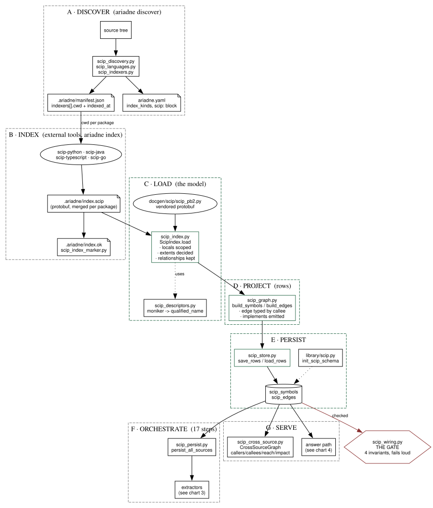
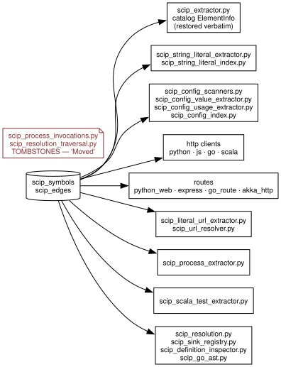
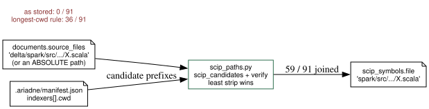
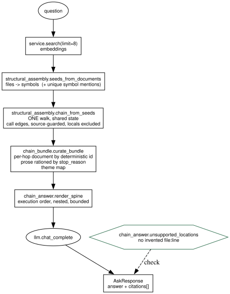

# The SCIP pipeline, start to finish

*What every SCIP component is, in the order data moves through it, and what is broken as of
2026-08-05. Component list enumerated from the tree, not from memory. Every number below was
measured in this repository; where something is unverified it says so.*

---

## 1. The whole path in one picture



<sub>Graphviz source: [`docs/scip-pipeline-overview.dot`](scip-pipeline-overview.dot) — regenerate with `make -C docs scip-charts` or `dot -Tsvg -o docs/scip-pipeline-overview.svg docs/scip-pipeline-overview.dot`</sub>

Green = rebuilt 2026-08-04/05. Red = the gate that decides whether any of it is trustworthy.

---

## 2. Components by stage

### A · Discovery and configuration

| module | owns |
|---|---|
| `scip_discovery.py` | walk the tree, decide which indexer runs where, write the manifest |
| `scip_languages.py` | the language registry — one source of truth for language metadata |
| `scip_indexers.py` | per-language indexer adapters (how to invoke each tool) |
| `scip_config.py` | source-config types and the error hierarchy: `ScipUnavailableError`, `ScipTooStaleError`, `ScipCorruptError` |
| `scip_review.py` | flags suspect discovery entries for the user |
| `scip_index_marker.py` | `.ariadne/index.ok`, the completion marker |

The manifest is load-bearing beyond discovery: `indexers[].cwd` is what makes document paths
and `scip_symbols.file` reconcilable at all (see §4).

### B · Indexing

External tools produce a protobuf per package, merged into one `.ariadne/index.scip`.
Ariadne does not parse source code here; it parses only what the indexer emitted.

### C · Loading — `scip_index.py` *(rebuilt)*

Decides what SCIP **means**, once, at load:

- **identity** — `local N` and `local N(name)` are numbered *per document*, so both shapes
  are scoped to their document before anything downstream sees them;
- **extent** — a definition's `range` is its identifier; the body is `enclosing_range`, and
  scip-java emits none, so extents are reconstructed positionally **per definition**;
- **relationships** — `is_implementation` is first-class;
- **empty is absent** — `kind` arrives as `UnspecifiedKind` and `display_name` as `''`, so
  one rule resolves both rather than a fallback that only fires on absence.

### D · Projection — `scip_graph.py` *(rebuilt)*

A **pure function** of a loaded index: `build_symbols` then `build_edges`. No connection, no
ordering, no second step a caller can forget. Types an edge by **what it points at**
(`classify_edge`), attributes a call site to the tightest enclosing definition, and emits
`implements` from relationships.

### E · Persistence — `scip_store.py` *(rebuilt)* + `library/scip.py`

`save_rows` replaces one source's rows: edges cleared **through** the symbols before those
symbols are deleted, and scoped to that source only.

### F · Orchestration — `scip_persist.py`

`persist_all_sources` plus 17 `persist_*` steps that run the extractors in dependency order.

### G · Serving — `scip_cross_source.py`

`CrossSourceGraph` (construction delegates to D/E) plus the query surface and three
consumers that were bundled with it historically: `compute_impact_radius`,
`build_reach_findings`, `shared_databases_from_config`.

### Cross-cutting

| module | owns |
|---|---|
| `scip_paths.py` *(new)* | the doc↔SCIP path seam — **the only** owner |
| `scip_freshness.py` *(rebuilt)* | is the index behind the tree; delegates all path work |
| `scip_wiring.py` *(new)* | the four ingest invariants, checked loudly |
| `scip_owning.py` | the single owning-symbol resolver: `(path, line)` → symbol |
| `scip_descriptors.py` | moniker → qualified name |

---

## 3. The extractor fan-out



<sub>Graphviz source: [`docs/scip-pipeline-extractors.dot`](scip-pipeline-extractors.dot) — regenerate with `make -C docs scip-charts` or `dot -Tsvg -o docs/scip-pipeline-extractors.svg docs/scip-pipeline-extractors.dot`</sub>

---

## 4. The path seam (why it exists)



<sub>Graphviz source: [`docs/scip-pipeline-path-seam.dot`](scip-pipeline-path-seam.dot) — regenerate with `make -C docs scip-charts` or `dot -Tsvg -o docs/scip-pipeline-path-seam.svg docs/scip-pipeline-path-seam.dot`</sub>

A path that resolves to nothing is **reported**, never guessed: of the live 91, 32 are
genuinely absent — 20 markdown/html, 12 `.java`/`.scala` under a module never indexed.
"Not indexed" and "no such symbol" are different answers.

---

## 5. The answer path (the north star)



<sub>Graphviz source: [`docs/scip-pipeline-answer-path.dot`](scip-pipeline-answer-path.dot) — regenerate with `make -C docs scip-charts` or `dot -Tsvg -o docs/scip-pipeline-answer-path.svg docs/scip-pipeline-answer-path.dot`</sub>

| stage | component | state |
|---|---|---|
| 1 travel index | `chain_from_seeds` | built · 195 seeds → 279 hops in 5.5s |
| 2 fetch document | `curate_bundle` | built · **but see §6.5** |
| 3 curate bundle | `ChainBundle` | built · prose by `stop_reason`, theme map |
| 4 formulate | `render_spine` → prompt | built · ~5k tokens, bounded |
| 5 respond | `AskResponse.citations` | built · unverified end-to-end (§6.8) |

---

## 6. What is broken

**6.1 The live store fails every ingest invariant.** `scip_wiring` on `ariadne.db`:
7,910 bare local ids · 499,249 cross-source edges · **0%** of 333,666 named symbols carry a
body extent · **0** `implements` edges. The rebuilt ingest reaches the store only via
`ariadne index`; until then nothing above stage 1 reads correct data.

**6.2 The edge count dropped and I cannot account for it.** Live 2,537,430 → rebuilt
2,421,985: calls −98,934, type_refs −115,487, implements +98,976. Removing the fused
cross-source edges does not explain it, because most of those endpoints still exist,
correctly separated. **Unexplained.**

**6.3 105,164 unattributed call sites** in databricks (4.5%) — references inside no
definition body. Counted, not investigated.

**6.4 `type_ref` is 69% of the graph and entirely unread.** 1,611,116 edges. Measured
earlier as +8pp of required-slot reach over call-only.

**6.5 SCIP's own documentation is discarded.** `ScipSymbolInfo.documentation` is parsed
(85% populated where measured) and then dropped: `CrossSourceSymbol` has no field for it and
`scip_symbols` has no column. Meanwhile stage 2 fetches catalog element docs that were
**78/78 mechanical stubs** on the Scala corpus — while the scaladoc for those same symbols
sits in the index. This is the largest unused SCIP capability and it costs no LLM spend.

**6.6 Dispatch traversal reaches 0 hops on real data.** `implements` is now followed, but
only when a hop is a `leaf`. The `runMerge` chain's 43 leaves are concrete, so nothing
fires. 98,155 of the 98,976 edges are databricks'. The trigger is probably wrong; it was
not redesigned.

**6.7 `structural_assembly` coverage is 71.4%**, below the 80% gate, after the dispatch
branch landed. A real shortfall.

**6.8 `ask` is unverified end-to-end.** Retrieval needs an embeddings key this environment
lacks, so stages 1–5 are verified by unit tests and by direct calls against a scratch
store — never by a real question producing a real answer.

**6.9 `scip_extractor`'s catalog projection was restored verbatim, not rebuilt.** `extract`
and `_subtype` are unexamined; the stub problem in 6.5 may originate there.

**6.10 Two tombstone modules** — `scip_process_invocations.py`,
`scip_resolution_traversal.py` — contain only "Moved" notes.

**6.11 The scratch verification store holds no documents.** Only `scip_symbols`/`scip_edges`
were persisted, so the document-fetch, prose and theme halves of stages 2–3 are verified on
fixtures alone.

**6.12 The Python verification corpus is gone.** The small end-to-end baseline used for
the scip-python path no longer exists.

---

## 7. Reproducing any of this

```bash
# the gate, on any store
.venv/bin/python -c "import sqlite3;from docgen.scip_wiring import wiring_report; \
  r=wiring_report(sqlite3.connect('file:ariadne.db?mode=ro',uri=True)); \
  print(r.ok); [print(c.name, c.ok, c.measured) for c in r.checks]"

# rebuild every source into a scratch DB and gate it (live store untouched)
.venv/bin/python evaluation/measurements/verify_scip_rebuild.py --include-databricks

# the doc->SCIP seam and the chain-shape measurements
.venv/bin/python evaluation/measurements/remeasure_5_1.py
.venv/bin/python evaluation/measurements/remeasure_chain_shape.py
```
