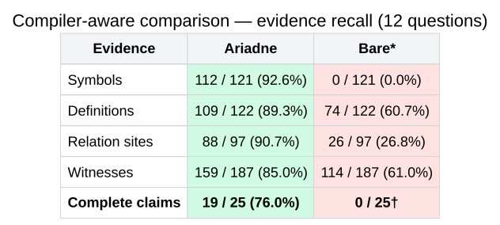

# Compiler-aware codebase comparison

## Scope

This document compares two ways of answering difficult questions about a large codebase. Ariadne uses compiler-derived code identities and relationships, alongside source evidence, to locate and verify an explanation. The bare LLM uses only ordinary source discovery tools such as file reads and text search. The selected questions show where compiler-level structure helps, where both approaches succeed, and where both still fail.

## Score summary

| System | Complete questions | Complete reviewed claims | Evidence recall |
| --- | ---: | ---: | --- |
| Ariadne | 8 / 12 | 19 / 25 | Symbols 112/121 · definitions 109/122 · relation sites 88/97 · witnesses 159/187 |
| Bare model | 2 / 12 | See evidence note below | Symbols 0/121* · definitions 74/122 · relation sites 26/97 · witnesses 114/187 |




The completion result comes from the accepted target-aligned audits: both systems completed questions 9 and 11; Ariadne additionally completed 1, 3, 4, 5, 8, and 10. Questions 2, 6, 7, and 12 were incomplete in both systems.

The [public comparison record](compiler-aware-comparison-record.json) contains exactly these twelve questions, their reviewed claims, panel outcomes, evidence coverage, and public source locations. It excludes private run artifacts, prompts, raw answers, absolute paths, and all other benchmark questions.

The [Ariadne proof manifest](compiler-aware-ariadne-proof-manifest.json) records the actual selected symbols and the claim-relevant source citations and supported directed transitions from the recorded run for all 25 claims. The [compressed replay fixture](compiler-aware-recorded-replay.json.gz) carries the full selected symbols, citations, transitions, and selection/completeness state for all twelve panel questions, including additional evidence beyond the reviewed claims. Both omit response prose, prompts, raw traces, private paths, and cost or usage data.

Build the minimal pinned source root, then reproduce the public verification without a model call or private artifact:

```bash
PYTHONDONTWRITEBYTECODE=1 \
python evaluation/chain-benchmark/build_compiler_aware_source_root.py \
  --dest /tmp/dbr17.3-panel-source

PYTHONDONTWRITEBYTECODE=1 \
python evaluation/chain-benchmark/verify_compiler_aware_comparison.py \
  --source-root /tmp/dbr17.3-panel-source
```

The builder fetches only the 46 source files referenced by this panel (Apache Spark `v4.0.0` and Delta `v4.0.0`, 1.36MB at this revision), verifies every downloaded SHA-256, and never fetches a spool, database, embedding, raw answer, or full checkout. The verifier rejects any source-file hash, required definition or relation line, witness fragment, panel membership, claim membership, or published aggregate that differs. It reads only this panel's twelve questions and twenty-five claims.

## Evidence terms and qualification contract

- A **symbol** is a named code element.
- A **definition** is that element at the correct file and line range.
- A **relation** is a source-verified relationship between code elements.
- A **witness** is the exact source excerpt that establishes behaviour.

For a question to be complete, every reviewed claim must have exact DBR 17.3 LTS repository, file, and line-range identity; an unambiguous definition; a source-verified, correctly directed relation at every required chain step; behavioural witness text; all required repository coverage; visible source provenance; and complete, non-truncated explanatory prose.

## Where the bare evidence data came from

The bare evidence values were measured after the bare run; they are not inferred from its completion score and no model call was made to obtain them. The input was a private saved bare-answer artifact. Each saved answer contains the model's prose, the files it read, and a hash for every opened source file.

The strict rescore parsed each answer's fenced source quotes, accepted a quote only when its claimed path appeared in the bare tool-read log, its file hash matched the target corpus, and its quoted lines exactly matched the target file at the claimed line number. It then compared those verified source spans with the 25 reviewed requirements for this panel:

- **Definition coverage:** a verified quote span covers the required source definition span.
- **Relation-site coverage:** a verified quote span covers the source line at which the reviewed relation occurs. This is source-location coverage, not a separately reconstructed SCIP edge.
- **Witness coverage:** a verified quote contains the required behavioural source fragment after whitespace normalization.
- **Symbol coverage:** the answer emits a canonical symbol ID through `selected_symbols`, `hydrated_symbols`, or a structured citation. The saved bare format emitted none of those fields, so its strict symbol result is `0 / 121`. This is a format-limited lower bound, not evidence that the model named no code elements in prose.

## Questions

### 1 — MERGE join and row-fate ordering

> When I MERGE INTO a Delta table versus a plain Spark V2 table, in what order does each run its join relative to deciding each row's insert/update/delete fate, and how does each emit the resulting rows?

- **Why chosen:** Ariadne completed this cross-system causal explanation while bare did not.
- **Why difficult:** A complete answer must prove ordering in two independent implementations: each joins first, then decides row fate, then emits output. Naming similar MERGE classes is insufficient.
- **What must be proven:** Spark's `MergeRowsExec` ordering and Delta's `ClassicMergeExecutor` ordering, including their distinct output steps.
- **Result:** Ariadne complete; bare incomplete.

### 2 — Why Delta diverts a MERGE from Spark's ordinary rewrite

> A MERGE starts as the same SQL whether the target is Delta or a plain V2 table. Why does the Delta one end up NOT going through Spark's normal row-level rewrite, and what does Delta do during analysis to divert it onto its own path?

- **Why chosen:** Neither system completed it, so it marks a shared analysis-and-rewrite gap.
- **Why difficult:** The answer must distinguish two plans with the same starting SQL and prove the analysis-time replacement before a later Delta post-hoc rule preprocesses it.
- **What must be proven:** Spark's native V2 rewrite path, then DeltaAnalysis replacing `MergeIntoTable` with `DeltaMergeInto` and forwarding it through `PreprocessTableMerge`.
- **Result:** Both incomplete.

### 3 — Generated and identity values during MERGE

> When a MERGE inserts rows into a Delta table that has generated or identity columns, who computes those column values as part of the merge, and how does that differ from a plain V2 table handling the same assignments?

- **Why chosen:** Ariadne completed a responsibility split that bare did not.
- **Why difficult:** It requires contrasting Delta's generated and identity machinery with Spark's ordinary V2 assignment alignment, without assigning Delta-only behavior to Spark.
- **What must be proven:** Delta resolves omitted generated expressions and identity values; Spark aligns assignments, fills ordinary defaults, or reports missing assignments.
- **Result:** Ariadne complete; bare incomplete.

### 4 — Runtime pruning during Delta MERGE

> Spark's group-based row-level ops can skip whole groups of data at runtime before touching them. When Delta runs a MERGE, does it have an equivalent way to avoid reading files it doesn't need, and is that pruning owned by Delta or Spark?

- **Why chosen:** Ariadne completed the ownership comparison while bare did not.
- **Why difficult:** Both systems can avoid work, but by different mechanisms and at different stages. The answer must not treat them as one generic pruning feature.
- **What must be proven:** Spark injects runtime group filtering; Delta's merge executor uses Delta-owned `filterFiles` before the source-target join.
- **Result:** Ariadne complete; bare incomplete.

### 5 — Why Delta forks the file writer

> Delta appears to run a forked version of Spark's file-writing machinery rather than the stock writer. What capability — about what actually gets written into the data files — would Delta need that the stock writer doesn't provide, justifying the fork?

- **Why chosen:** Ariadne completed this explanation of a code fork while bare did not.
- **Why difficult:** The rationale is an absence in the stock writer, so the proof must show the exact schema capability the fork adds rather than merely observe copied source code.
- **What must be proven:** Delta's fork preserves requested partition columns in the output data schema while the stock writer records only data columns.
- **Result:** Ariadne complete; bare incomplete.

### 6 — Delta commit lifecycle versus normal Spark output commit

> After a Delta write I don't see the rename-into-final-place or the `_SUCCESS` marker a normal Spark file write leaves — what does Delta change about the commit lifecycle, and which part of the usual committer behavior does it deliberately skip?

- **Why chosen:** Neither system completed this Delta-versus-Spark commit-lifecycle comparison.
- **Why difficult:** It is a negative claim: the answer must show both what Delta records instead and which Hadoop commit behavior it deliberately does not invoke.
- **What must be proven:** Delta gathers `AddFile` metadata without Hadoop's rename-based job commit; Spark's normal Hadoop committer moves staged output and removes staging.
- **Result:** Both incomplete.

### 7 — Why a streaming offset needs both version and position

> A Delta streaming source hands Spark a (version, position) pair as the end of each micro-batch rather than just the table version. Why isn't a plain version number enough — what does the position let it express?

- **Why chosen:** Neither system completed this multi-hop streaming explanation.
- **Why difficult:** The answer has to connect Spark's request for a bounded end offset to Delta's rate-limited selection of individual files inside a commit.
- **What must be proven:** Spark asks for an end offset under a source-specific `ReadLimit`; Delta advances `(version, index)` through admitted indexed files.
- **Result:** Both incomplete.

### 8 — Strictly increasing offsets inside one large commit

> When one large Delta commit is spread across several micro-batches, how does the streaming source guarantee Spark always sees strictly increasing offsets, even partway through that single commit?

- **Why chosen:** Ariadne completed this streaming-ordering explanation while bare did not.
- **Why difficult:** The proof crosses file indexing, filtering, rate limiting, and lexicographic comparison; a version-only explanation cannot establish the guarantee.
- **What must be proven:** Delta writes each file's `(version, index)` coordinate, excludes prior coordinates, chooses the next admitted file, and validates monotonicity.
- **Result:** Ariadne complete; bare incomplete.

### 9 — Exactly-once replay protection for a streaming write

> My Delta streaming write needs exactly-once even if a micro-batch is replayed after a crash. How does the sink detect it already committed a given batch and skip re-writing it, and what identifier does that rely on that survives a restart?

- **Why chosen:** It is a shared target-qualified success and therefore tests where both systems can construct a complete chain.
- **Why difficult:** A complete answer must connect checkpoint persistence, the sink's replay guard, and the transaction record; an answer that proves only one endpoint is incomplete.
- **What must be proven:** The checkpoint-backed query ID, `txnVersion(queryId)` replay check, and `SetTransaction(queryId, batchId)` commit record.
- **Result:** Both complete.

### 10 — Parser policy versus Delta write-time identity enforcement

> When a Delta table has a GENERATED ALWAYS AS IDENTITY column and I try to INSERT my own explicit value, it's rejected. Given Delta reuses Spark's parser for most of the DDL, which side actually owns enforcing that you can't supply your own identity value?

- **Why chosen:** Ariadne completed the phase distinction while bare did not.
- **Why difficult:** Spark records the policy during parsing, but Delta enforces it later. The answer must prove that phase boundary rather than saying “Spark parser” or “Delta” alone.
- **What must be proven:** Spark persists the explicit-insert policy in identity metadata; Delta's write path checks it and raises the GENERATED ALWAYS error.
- **Result:** Ariadne complete; bare incomplete.

### 11 — Deletion-vector filtering in the plan and Parquet reader

> On a Delta table with deletion vectors, deleted rows are dropped at read time without rewriting files. That filtering is split between a query-plan step and the physical Parquet reader — how do the two agree on which rows are deleted, and which one actually evaluates the drop?

- **Why chosen:** It is a shared target-qualified success and tests a non-call-based contract between plan and reader.
- **Why difficult:** The two components communicate through a hidden byte field, not a direct call. The answer must separate supplying the marker value from evaluating the filter.
- **What must be proven:** The reader populates the shared deletion marker from the deletion vector; the plan's logical filter evaluates the keep value and removes the hidden field afterward.
- **Result:** Both complete.

### 12 — Delta writer-fork capability and fallback path

> Delta ships its own fork of Spark's file-format writer. What single capability — about writing partition values into the data files — justified forking rather than configuring the stock writer, and how does the fork still fall back to Spark's normal write path where it can?

- **Why chosen:** Neither system completed this second writer-fork question; it keeps the remaining fallback-path gap visible.
- **Why difficult:** It requires both the narrow partition-column capability difference and a separate proof that the fork delegates to Spark's planned write path when available.
- **What must be proven:** Delta preserves partition attributes when required, uses the planned `WriteFiles` route when present, and otherwise falls back to its copied RDD-write route.
- **Result:** Both incomplete.
